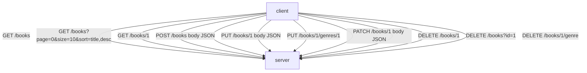
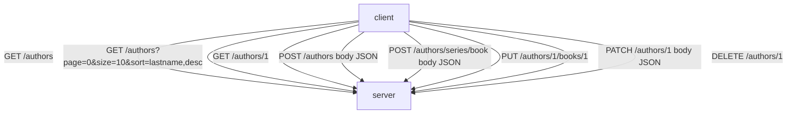
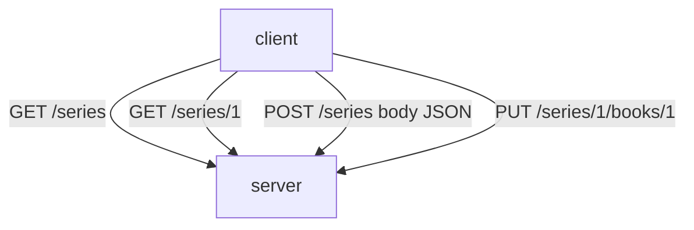
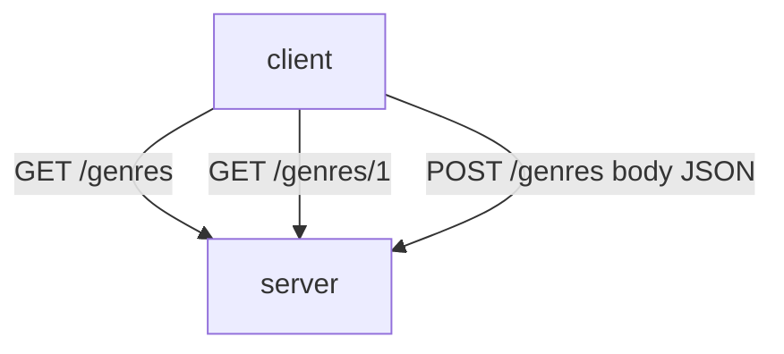
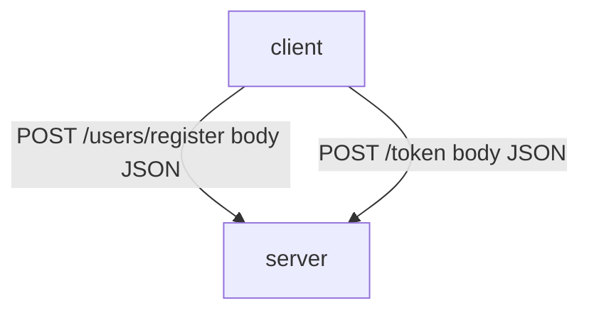
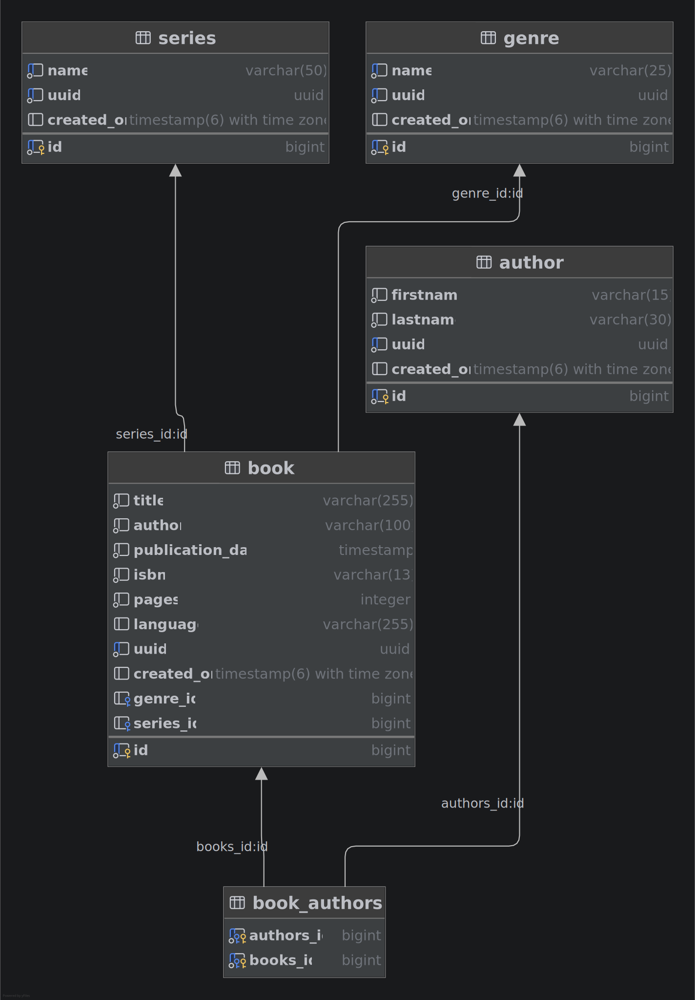

# Bookify

**Bookify** is a **RESTful API for managing a book catalog**,
providing endpoints to handle books, authors, genres, and series.

The API supports full CRUD operations and enables clients to manage relationships between entities,
such as assigning multiple authors to a book, grouping books into series, and categorizing them by genre.

## Table of Contents

- [Requirements](#requirements)
    - [Creation](#creation)
    - [Deletion](#deletion)
    - [Updates](#updates)
    - [Relationships](#relationships)
    - [Retrieval](#retrieval)
    - [Security](#security)
- [Happy Paths](#happy-paths)
    - [Happy Path v1](#happy-path-v1)
    - [Happy Path v2](#happy-path-v2)
- [Endpoints](#endpoints)
    - [Books](#books)
    - [Authors](#authors)
    - [Series](#series)
    - [Genres](#genres)
    - [Auth](#auth)
- [Views](#views)
- [Database](#database)
    - [Entity-Relationship Diagram](#entity-relationship-diagram)

## Requirements

All data must be **persisted in a database** (i.e., stored permanently and available across application restarts).

### Creation

- [X] Add a new author (first name, last name).
- [X] Add a new author with a default series and book pre-assigned.
- [X] Add a new genre (name).
- [X] Add a new series (name), which must include at least one book upon creation.
- [X] Add a new book (title, author, publication date, ISBN, page count, language).

### Deletion

- [X] Delete an author and all solely-owned books. If a book has multiple authors, only the association is removed (the
  book itself is retained).
- [X] Delete a genre only if no books are currently assigned to it.
- [ ] Delete a series only if it contains no books.
- [X] Delete a book without deleting its associated series or authors.
- [X] Delete a book along with its assigned genre. Other books that shared the genre are reassigned to the default genre
  rather than deleted.

### Updates

- [X] Edit author details (first name, last name).
- [X] Edit a genre name.
- [ ] Edit a series (rename it and manage assigned books).
- [ ] Edit book details (title, authors, publication date, ISBN, page count).

### Relationships

- [X] Assign a book to a series.
- [X] Assign multiple authors to a book (many-to-many).
- [X] Assign exactly one genre to each book.
- [X] Books with no genre assigned to the default genre.

### Retrieval

- [X] List all books.
- [X] List all genres.
- [X] List all authors.
- [X] List all series.
- [X] View a specific series with its books and their authors.
- [X] View a specific genre with its associated books.
- [X] View a specific author with their books.

### Security

- [X] It is possible to see books, series, etc. without authentication.
- [X] Two roles: ROLE_USER and ROLE_ADMIN.
- [X] Use JWT token:
    - [X] Google OAuth.
- [X] Only admin can see usernames and roles of users - /users endpoint.
- [X] Register to be user:
    - [X] Own implementation.
    - [X] Google.
- [X] Save users and admin to database.
- [X] User can see books, but cannot manage them.
- [X] Only admin can change state of application (delete, add, edit books, series, etc.).
- [X] HTTPS encryption, certificate generated with OpenSSL.
- [X] CORS - requests from frontend domain.
- [X] CSRF protection.
- [X] E-mail confirmation.

## Happy Paths

### Happy Path v1

> [!IMPORTANT]
> The happy path scenario is not aligned with the current system behavior and requirements.

User creates series "Head First" with books "Head First Java" by Kathy Sierra and Bert Bates (genre: Programming),
and "Head First Design Patterns" by Eric Freeman and Elisabeth Robson (genre: Software Engineering).

Given there is no books, authors, series and genres created before:

1. When user goes to /books then they can see no books.
2. When user posts to /books with book "Head First Java" then book "Head First Java" is returned with id 1.
3. When user posts to /books with book "Head First Design Patterns" then book "Head First Design Patterns" is returned
   with id 2.
4. When user goes to /genres then user can see no genres.
5. When user posts to /genres with genre "Programming" then genre "Programming" is returned with id 1.
6. When user posts to /genres with genre "Software Engineering" then genre "Software Engineering" is returned with id 2.
7. When uses goes to /books/1 then user can see default genre.
8. When user puts to /books/1/genres/1 then genre with id 1 ("Programming") is added to book with id 1 ("Head First
   Java").
9. When user goes to /books/1 then user can see "Programming" genre.
10. When user puts to /books/2/genres/2 then genre with id 2 ("Software Engineering") is added to book with id 2 ("Head
    First Design Patterns").
11. When user goes to /series then user can see no series.
12. When user posts to /series with series "Head First" then series "Head First" is returned with id 1.
13. When user goes to /series/1 then user can see no books added to series.
14. When user puts to /series/1/books/1 then book with id 1 ("Head First Java") is added to series with id 1 ("Head
    First").
15. When user puts to /series/1/books/2 then book with id 2 ("Head First Design Patterns") is added to series with id
    1 ("Head First").
16. When user goes to /series/1/books then user can see 2 books (id 1, id 2).
17. When user posts to /authors with author "Kathy Sierra" then author "Kathy Sierra" is returned with id 1.
18. When user puts to /books/1/authors/1 then author with id 1 ("Kathy Sierra") is added to book with id 1 ("Head First
    Java").

### Happy Path v2

1. When user goes to /authors then user can see no authors.
2. When user posts to /authors with author "Eric Freeman" then author "Eric Freeman" is returned with id 1.
3. When user posts to /authors with author "Elisabeth Robson" then author "Elisabeth Robson" is returned with id 2.
4. When user goes to /genres then user can see only default genre with id 1.
5. When user posts to /genres with genre "Software Engineering" then genre "Software Engineering" is returned with id 2.
6. When user goes to /books then user can see no books.
7. When user posts to /books with book "Head First Design Patterns" of author with id 1 ("Eric Freeman") then book "Head
   First Design Patterns" is returned with id 1.
8. When user posts to /books with book "Head First JavaScript" of author with id 1 ("Eric Freeman") then book "Head
   First JavaScript" is returned with id 2.
9. When user goes to /books/1 then user can see book info and the default genre with id 1 and name default.
10. When user puts to /books/1/genres/2 then genre with id 2 ("Software Engineering") is added to book with id 1 ("Head
    First Design Patterns").
11. When user goes to /books/1 then user can see book info and "Software Engineering" genre.
12. When user puts to /authors/2/books/1 then author with id 2 ("Elisabeth Robson") is added to book with id 1 ("Head
    First Design Patterns").
13. When user goes to /books/1 then user can see book info and 2 authors (id1 and id2).
14. When user goes to /series then user can see no series.
15. When user posts to /series with series "Head First Series" and book with id 1 then series "Head First Series" is
    returned with id 1.
16. When users puts to /series/1/books/2 then book with id 2 ("Head First JavaScript") is added to series with id 1 ("
    Head First Series").
17. When user goes to /series/1 then user can see series with 2 books (id1 and id2).

## Endpoints

Swagger is available at: `/swagger-ui/index.html`

### Books

### Authors

### Series

### Genres

### Auth

## Views

- homepage: `/home.html`
- books: `/view/books`

## Database

### Entity-Relationship Diagram

