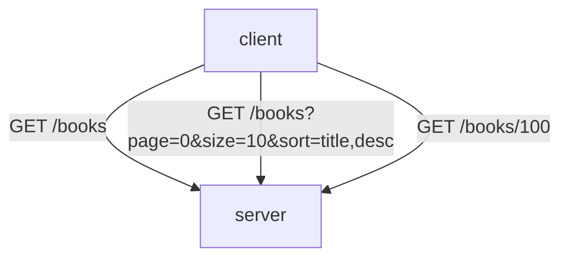
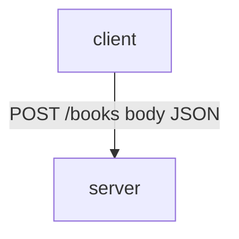
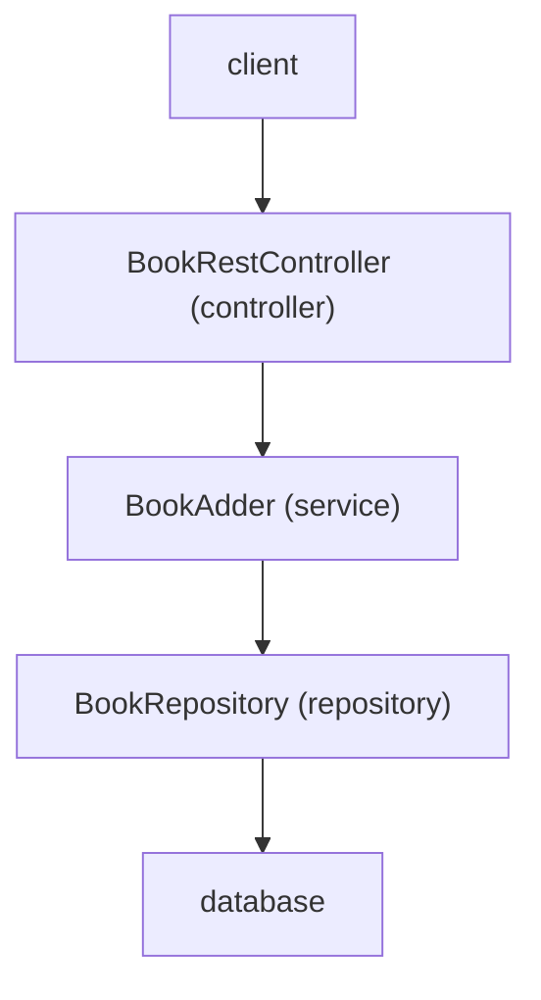
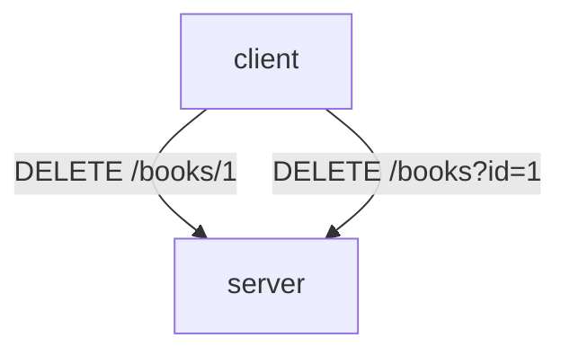
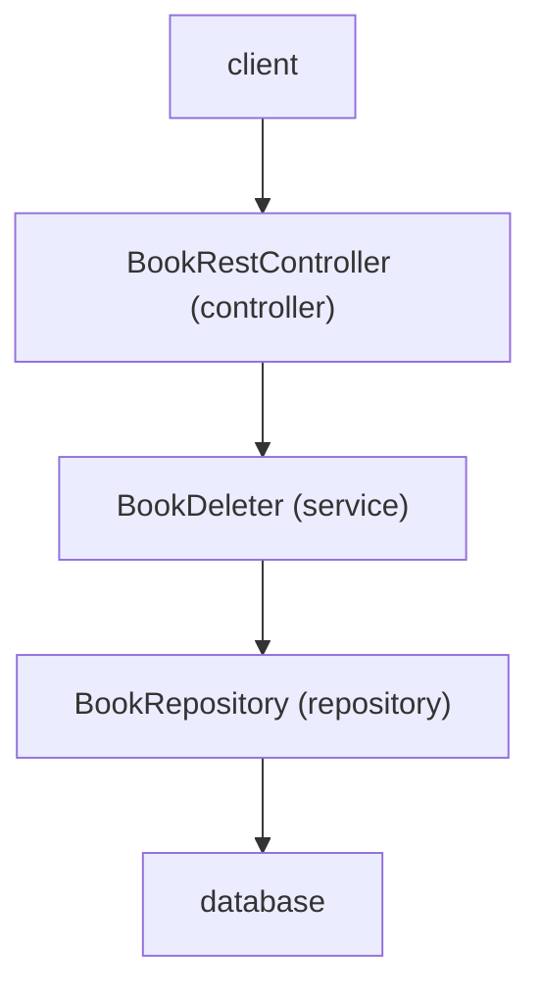
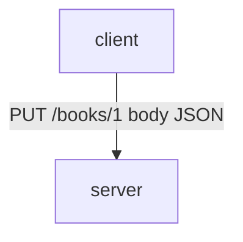
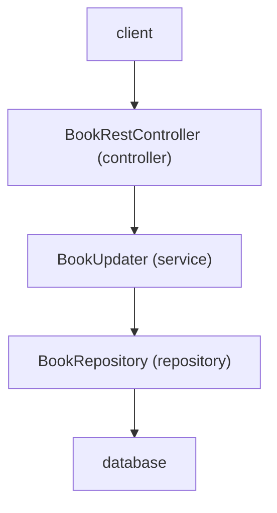
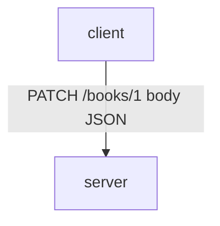

# Bookify

## Table of Contents

- [Requirements](#requirements)
- [Endpoints](#endpoints)
    - [GET Endpoints](#get-endpoints)
    - [POST Endpoints](#post-endpoints)
    - [DELETE Endpoints](#delete-endpoints)
    - [PUT Endpoints](#put-endpoints)
    - [PATCH Endpoints](#patch-endpoints)
- [Views](#views)
- [Database](#database)
    - [Entity-Relationship Diagram](#entity-relationship-diagram)

## Requirements

The system should support the following operations:

**Creation**

1. Add a new author (first name and last name).
2. Add a new genre (genre name).
3. Add a new series (series name; must include at least one book).
4. Add a new book (title, authors, publication date, ISBN, number of pages).

**Deletion**

5. Delete an author along with all associated books.
6. Delete a genre only if no books are assigned to it.
7. Delete a series only if it contains no books.
8. Delete a book.

**Updates**

9. Edit author details (first name and last name).
10. Edit a genre name.
11. Edit a series (rename and manage assigned books).
12. Edit book details (title, authors, publication date, ISBN, number of pages).

**Relationship**

13. Assign books to a series.
14. Assign authors to books (many-to-many relationship).
15. Assign exactly one genre to each book.

**Retrieval**

16. View all books.
17. View all genres.
18. View all authors.
19. View all series.
20. View all series with their books and corresponding authors.
21. View all genres with their associated books.
22. View all authors with their books.

## Endpoints

Swagger is available at: `/swagger-ui/index.html`

### GET Endpoints

### POST Endpoints

### DELETE Endpoints

### PUT Endpoints

`PUT` replaces the entire resource with the data provided in the request.

### PATCH Endpoints

`PATCH` applies partial updates to a resource, sending only the fields that need to be changed.

## Views

- homepage: `/home.html`
- books: `/view/books`

## Database

Table `book_authors`:

- book_id
- author_id

### Entity-Relationship Diagram

