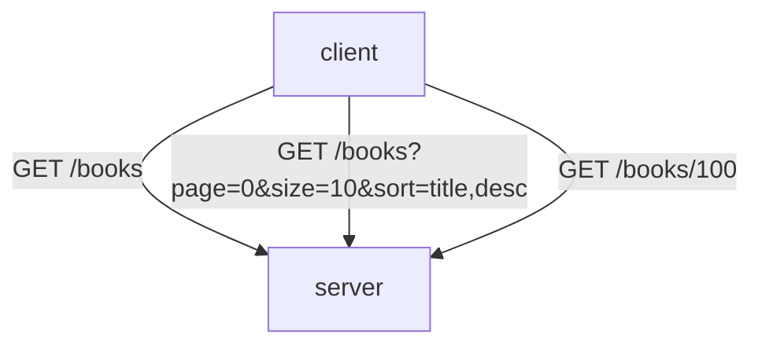
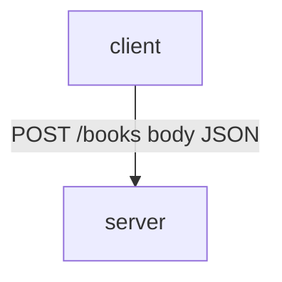
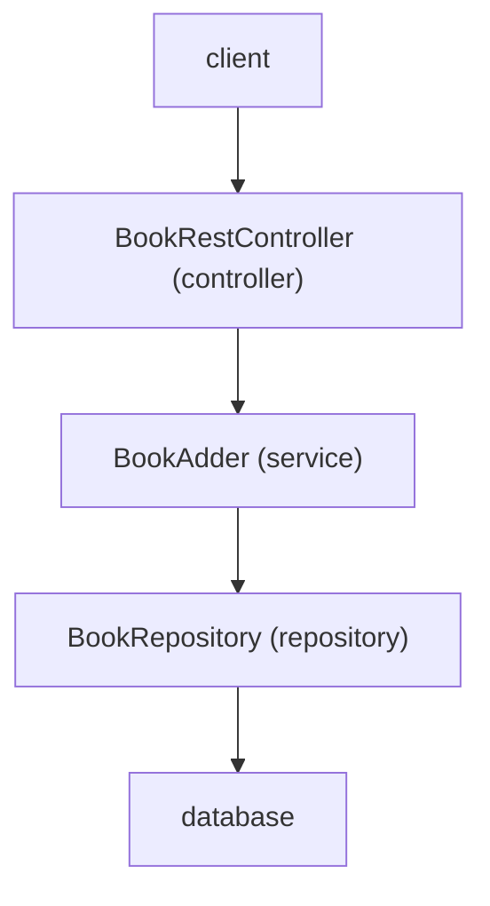
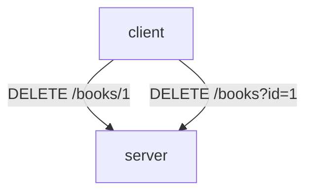
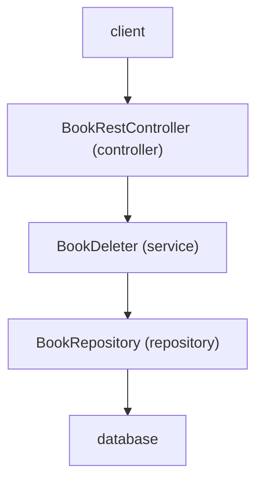
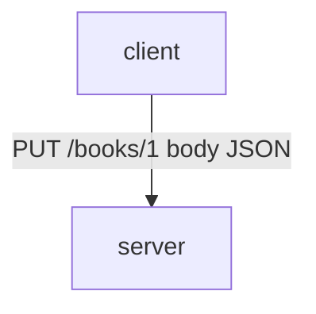
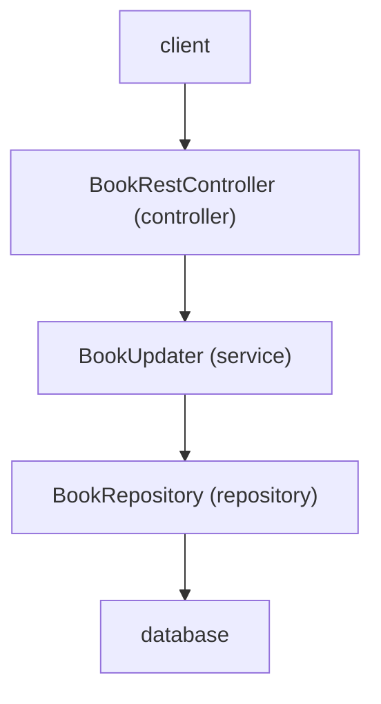
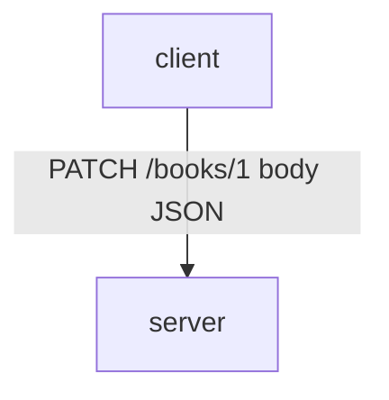

# Bookify

## Table of Contents

- [Requirements](#requirements)
- [Happy Path](#happy-path)
- [Endpoints](#endpoints)
    - [GET Endpoints](#get-endpoints)
    - [POST Endpoints](#post-endpoints)
    - [DELETE Endpoints](#delete-endpoints)
    - [PUT Endpoints](#put-endpoints)
    - [PATCH Endpoints](#patch-endpoints)
- [Views](#views)
- [Database](#database)
    - [Entity-Relationship Diagram](#entity-relationship-diagram)

## Requirements

The system should support the following operations and ensure that all data is **persisted in a database**
(i.e., data must be stored permanently and remain available between application restarts).

**Creation**

- [X] Add a new author (first name and last name).
- [X] Add a new genre (genre name).
- [X] Add a new series (series name; must include at least one book).
- [X] Add a new book (title, author, publication date, ISBN, number of pages, language).

**Deletion**

5. Delete an author along with all associated books.
6. Delete a genre only if no books are assigned to it.
7. Delete a series only if it contains no books.
8. Delete a book.

**Updates**

9. Edit author details (first name and last name).
10. Edit a genre name.
11. Edit a series (rename and manage assigned books).
12. Edit book details (title, authors, publication date, ISBN, number of pages).

**Relationship**

13. Assign books to a series.
14. Assign authors to books (many-to-many relationship).
15. Assign exactly one genre to each book.
16. If no genre is assigned to book, it should be displayed as "default".

**Retrieval**

- [X] Show all books.
- [ ] Show all genres.
- [X] Show all authors.
- [ ] Show all series.
- [ ] Show all series with their books and corresponding authors.
- [ ] Show all genres with their associated books.
- [ ] Show all authors with their books.

## Happy Path

User creates series "Head First" with books "Head First Java" by Kathy Sierra and Bert Bates (genre: Programming),
and "Head First Design Patterns" by Eric Freeman and Elisabeth Robson (genre: Software Engineering).

Given there is no books, authors, series and genres created before:

1. When user goes to /books then they can see no books.
2. When user posts to /books with book "Head First Java" then book "Head First Java" is returned with id 1.
3. When user posts to /books with book "Head First Design Patterns" then book "Head First Design Patterns" is returned
   with id 2.
4. When user goes to /genres then user can see no genres.
5. When user posts to /genres with genre "Programming" then genre "Programming" is returned with id 1.
6. When user posts to /genres with genre "Software Engineering" then genre "Software Engineering" is returned with id 2.
7. When uses goes to /books/1 then user can see default genre.
8. When user puts to /books/1/genres/1 then genre with id 1 ("Programming") is added to book with id 1 ("Head First
   Java").
9. When user goes to /books/1 then user can see "Programming" genre.
10. When user puts to /books/2/genres/2 then genre with id 2 ("Software Engineering") is added to book with id 2 ("Head
    First Design Patterns").
11. When user goes to /series then user can see no series.
12. When user posts to /series with series "Head First" then series "Head First" is returned with id 1.
13. When user goes to /series/1 then user can see no books added to series.
14. When user puts to /series/1/books/1 then book with id 1 ("Head First Java") is added to series with id 1 ("Head
    First").
15. When user puts to /series/1/books/2 then book with id 2 ("Head First Design Patterns") is added to series with id
    1 ("Head First").
16. When user goes to /series/1/books then user can see 2 books (id 1, id 2).
17. When user posts to /authors with author "Kathy Sierra" then author "Kathy Sierra" is returned with id 1.
18. When user puts to /books/1/authors/1 then author with id 1 ("Kathy Sierra") is added to book with id 1 ("Head First
    Java").

## Endpoints

Swagger is available at: `/swagger-ui/index.html`

### GET Endpoints

### POST Endpoints

### DELETE Endpoints

### PUT Endpoints

`PUT` replaces the entire resource with the data provided in the request.

### PATCH Endpoints

`PATCH` applies partial updates to a resource, sending only the fields that need to be changed.

## Views

- homepage: `/home.html`
- books: `/view/books`

## Database

### Entity-Relationship Diagram

