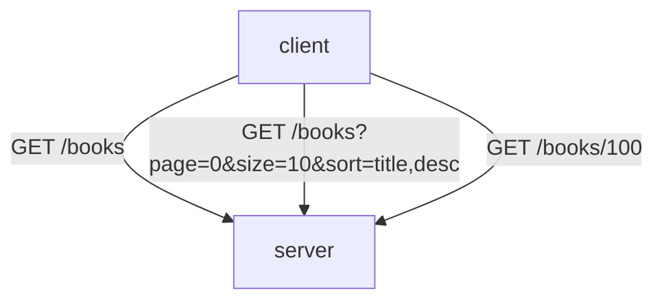
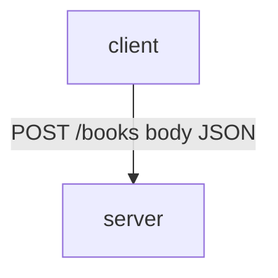
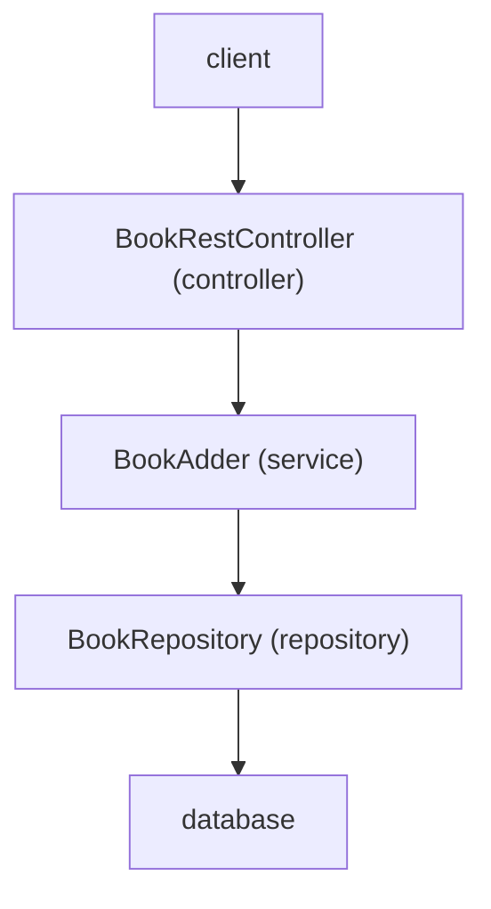
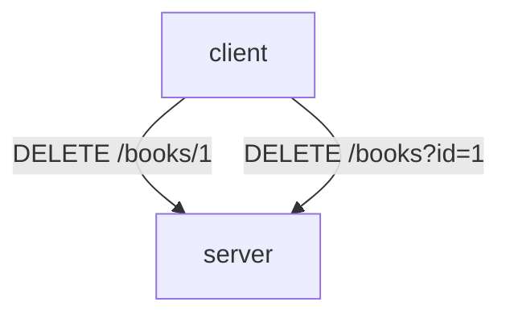
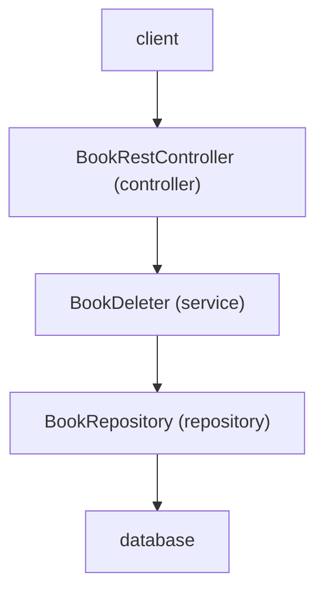
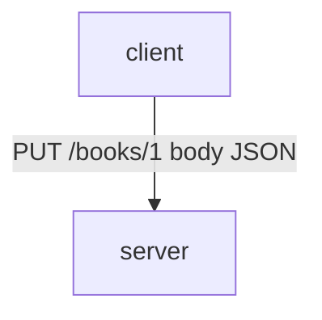
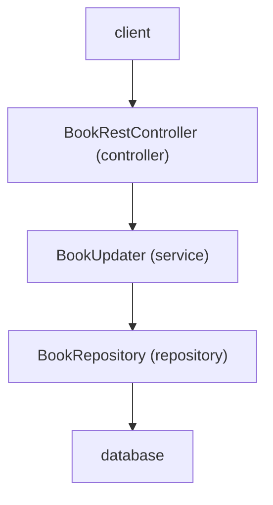
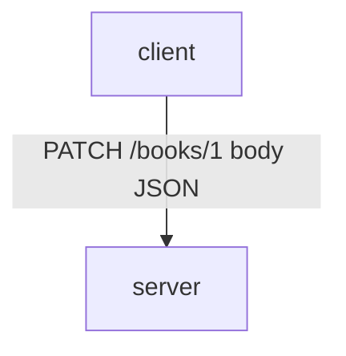

# Bookify

## Table of Contents

- [Endpoints](#endpoints)
    - [GET Endpoints](#get-endpoints)
    - [POST Endpoints](#post-endpoints)
    - [DELETE Endpoints](#delete-endpoints)
    - [PUT Endpoints](#put-endpoints)
    - [PATCH Endpoints](#patch-endpoints)
- [Views](#views)
- [Database](#database)
    - [Entity-Relationship Diagram](#entity-relationship-diagram)

## Endpoints

Swagger is available at: `/swagger-ui/index.html`

### GET Endpoints

### POST Endpoints

### DELETE Endpoints

### PUT Endpoints

`PUT` replaces the entire resource with the data provided in the request.

### PATCH Endpoints

`PATCH` applies partial updates to a resource, sending only the fields that need to be changed.

## Views

- homepage: `/home.html`
- books: `/view/books`

## Database

Table `book_authors`:

- book_id
- author_id

### Entity-Relationship Diagram

