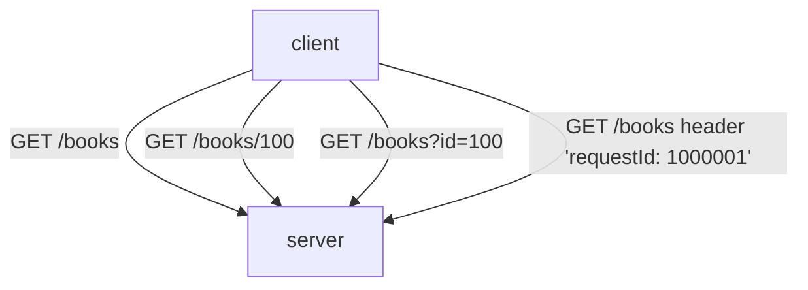
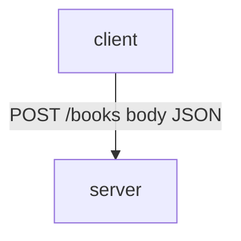
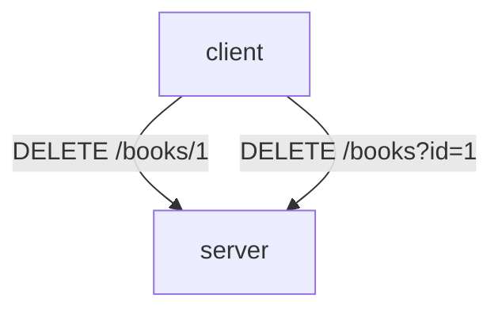
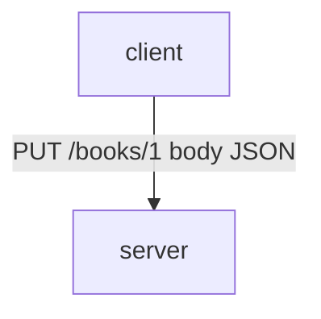

# Bookify

## Table of Contents

- [Endpoints](#endpoints)
    - [GET Endpoints](#get-endpoints)
    - [POST Endpoints](#post-endpoints)
    - [DELETE Endpoints](#delete-endpoints)
    - [PUT Endpoints](#put-endpoints)
- [Views](#views)

## Endpoints

Swagger is available at: `/swagger-ui/index.html`

### GET Endpoints

### POST Endpoints

### DELETE Endpoints

### PUT Endpoints

`PUT` replaces the entire resource with the data provided in the request.

## Views

- homepage: `/home.html`
- books: `/view/books`